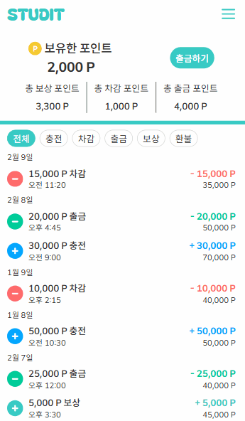

# 🧠 STUDIT - 학습 동기 부여 서비스

> **돈 걸고 공부하자!**  
> 금전적 동기를 활용해 학습 집중력을 높이는 스터디 플랫폼

## 📌 개요

STUDIT는 사용자가 일정 금액을 입금하고, 정해진 시간 동안 공부 인증을 수행하며 **학습 의지를 강화**할 수 있는 서비스입니다.  
성공 시 포인트를 유지하고, 실패자의 포인트는 성공자에게 **자동 분배**됩니다.

## ⚙️ 기술 스택

### 🧩 프론트 엔드
- **React 19**
- **React Router DOM v7**
- **React Query (TanStack Query)**
- **TypeScript**
- **Vite**
- **ESLint**
- **TypeScript ESLint**
- **Tailwind CSS** (via `@tailwindcss/vite`)
- **Framer Motion** - 애니메이션 구현
- **Recharts** - 차트 시각화
- **React Slick / Slick Carousel** - 슬라이더 구현

### 🛠 기타 
- **MSW**
- **Firebase**
- **Sentry** - 에러 추적 및 모니터링
- **Overlay-kit** - 모달 및 오버레이 UI 구현
- **cosine-similarity** - 유사도 계산 유틸
- **vite-plugin-svgr** - SVG를 React 컴포넌트로 사용
  
## 🛠 주요 기능

### ✅ 투두 리스트 & 타이머 기반 학습 인증 시스템
- **타이머 동기화 처리**: 10초마다 서버에서 타이머 데이터를 받아와 로컬 상태와 비교 및 동기화
- **스터디원 실시간 상태 표시**: 각 스터디원의 타이머 실행 여부를 실시간 확인, 아이콘으로 표시
- **음성 명령 제어**: `SpeechRecognition API`를 사용해 "공부 시작", "멈춰" 등 음성 명령과 투두 이름 인식 → 타이머 실시간 제어
- **투두 리스트 CRUD + 타이머 연동**: 항목별 학습 시간을 개별로 측정 가능하도록 구성

### 🌟 추천 및 인기 스터디 노출 로직
- **스터디 추천 시스템**: `TF-IDF` + `코사인 유사도` 기반 콘텐츠 유사도 분석을 `Web Worker`로 실행해 UI 렌더링에 영향 없이 실시간 추천
- **인기 스터디 정렬 로직**: 참여자 수, 목표 시간, 공지사항 유무 등 요소에 커스텀 가중치를 부여해 인기 순위 도출

### 📊 사용자 통계 시각화
- `Recharts` 기반 **커스텀 BarChart**로 평균 비교 통계 제공

### 🚀 개발 편의성 및 안정성
- **`MSW`로 API 전면 모킹** → 백엔드 지연 시에도 개발 가능
- 각 요청에 대해 **상세 유효성 검사 및 HTTP 에러 응답 처리(400, 404 등)** 구성 → 실제 서버 환경과 유사하게 테스트
- `Sentry`로 **프론트엔드 에러 실시간 추적**
- **CI/CD 자동화 (`AWS S3`, `CloudFront`, `GitHub Actions`)**

### 💰 포인트 내역 UX 개선
- 필터링 + 무한 스크롤 구현
- 스크롤 이동을 돕는 **상단 이동 버튼** 추가 및 출금 입력창에 포커스 시 `Enter 키`로도 출금이 가능하도록 구현하여 UX 개선

## 🎬 시연 영상

<table>
  <tr>
    <td align="center"><strong>✅ 학습 인증 및 스터디 관리</strong></td>
    <td align="center"><strong>📊 사용자 관리 </strong></td>
    <td align="center"><strong>💰 포인트 내역</strong></td>
  </tr>
  <tr>
    <td></td>
    <td></td>
    <td></td>
  </tr>
</table>
